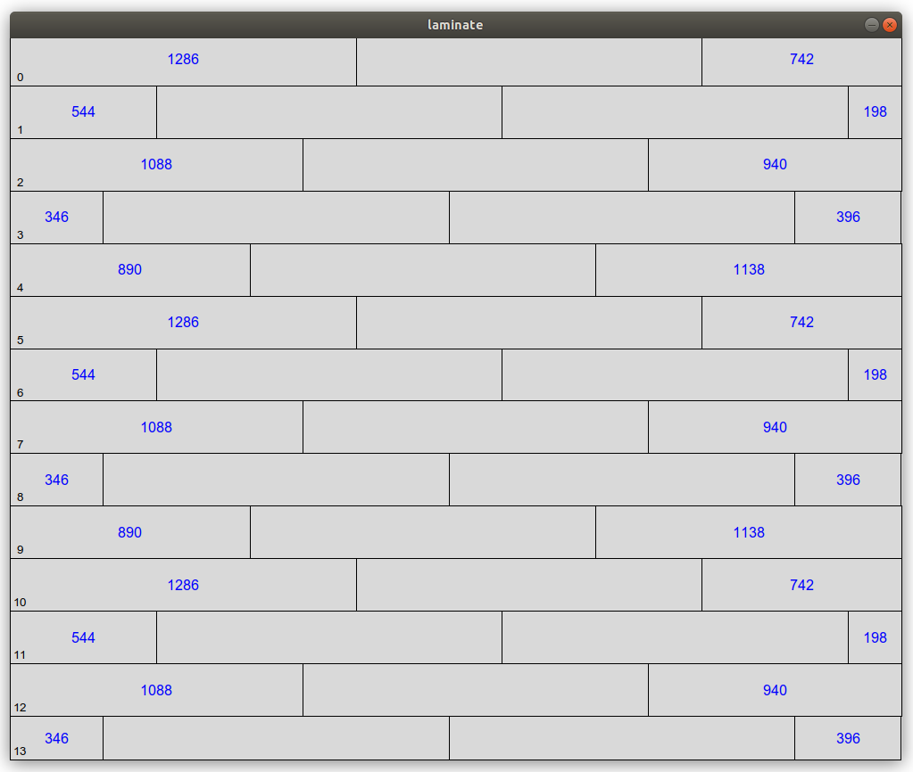

# laminate

A simple python program to plan your laminate flooring installation and visualize the result.



## Algorithm

The algorithm simply lays the tiles one after the other in a row.

The last tile of the row is cut where needed, and the remaining part is used as first tile in the next row.

It is possible to override the first tile for each row with a custom tile (e.g. if the one proposed by the algorithm is too short).

### Variation for floor tiles

A simple variation for floor tiles, arranged as a grid, is possible using the GridInstallation class.
In this case, it is possible to override also the width for each row.

## Limitations
- only rectangular rooms are supported
- the first tile is the one on the top left
- tiles are laid with the length parallel to the first room dimension

## How to use it

Take the `main()` as an example of usage, and customize it according to your needs.
The result will be displayed both in a UI (see the picture before) and in a textual format, like the following:

```
## Installation ##
* Room: [3330, 2700]
* Tile: [1286, 194]
* Border: 8
* Init tiles: {5: 1286, 10: 1286}
##
0 : [1286, 194] [1286, 194] [742, 194]
1 : [544, 194] [1286, 194] [1286, 194] [198, 194]
2 : [1088, 194] [1286, 194] [940, 194]
3 : [346, 194] [1286, 194] [1286, 194] [396, 194]
4 : [890, 194] [1286, 194] [1138, 194]
5 : [1286, 194] [1286, 194] [742, 194]
6 : [544, 194] [1286, 194] [1286, 194] [198, 194]
7 : [1088, 194] [1286, 194] [940, 194]
8 : [346, 194] [1286, 194] [1286, 194] [396, 194]
9 : [890, 194] [1286, 194] [1138, 194]
10 : [1286, 194] [1286, 194] [742, 194]
11 : [544, 194] [1286, 194] [1286, 194] [198, 194]
12 : [1088, 194] [1286, 194] [940, 194]
13 : [346, 162] [1286, 162] [1286, 162] [396, 162]
##
```

## TODO
- use a configuration file
- add width for last row in visualization

## License
This is open-source software released under the terms of the GPL v3.0.